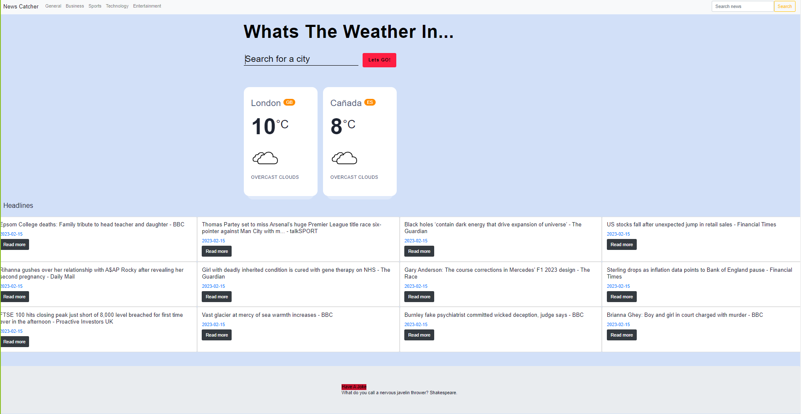

# News-Catcher

# A simple, clean and responsive news app, delivering world wide live and historical news data and weather information

# Features:

- Bootstrap.

- Interactive (i.e., accept and respond to user input).

- Server-side APIs.

- Modals

- Client-side storage to store persistent data.

- Responsive.

# Built With

- HTML

- CSS

- JavaScript

# Author

- Michael Manyonganise

- Mary Popoola

- Marcus Aragbaye

# Acknowledgments

- NewsAPI for providing live news data

